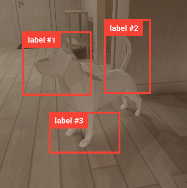

A widget to create bounding box annotation on an image.

## Preview
[](https://github.com/Accel03/bounding_box_annotation/raw/main/assets/preview.png)

Live Demo   :
[Click Here](https://accel03.github.io/bounding_box_annotation_demo/)


## Features
- Draw rectangles (bounding boxes) on an image.
- Add / edit custom text to label the annotation.
- Get annotation details (e.g. Offset).
- Crop image into multiple parts based on bounding boxes.
- Delete annotation.


## Usage
Create a `BoundingBoxAnnotation` widget, and pass the required parameters.
``` dart
final AnnotationController annotationController = AnnotationController();

BoundingBoxAnnotation(
    controller: annotationController,
    imageBytes: imageBytes
)
```


Customize image and canvas size.
``` dart
BoundingBoxAnnotation(
    controller: annotationController,
    imageBytes: imageBytes
    imageWidth: 400,
    imageHeight 400,
    boxFit: BoxFit.fill
)
```


Customize annotation styles.
``` dart
BoundingBoxAnnotation(
    controller: annotationController,
    imageBytes: imageBytes
    color: Colors.blue,
    strokeWidth: 5.0,
)
```


Create a `List` variable to store the annotation(s).
``` dart
List<AnnottaionDetails>> annotationList = [];
```


Get annotation details:
``` dart
final AnnotationController annotationController = AnnotationController();

List<AnnottaionDetails>> annotationList = await annotationController.getData();
```


Add annotation manually:
``` dart
final AnnotationController annotationController = AnnotationController();
double x = 10.0
double y = 20.0
double width = 150.0
double height = 150.0
String label = "Test"

annotationController.addAnnotation(x, y, width, height, label);
```


Clear all annotation(s):
``` dart
final AnnotationController annotationController = AnnotationController();

annotationController.clear();
```


