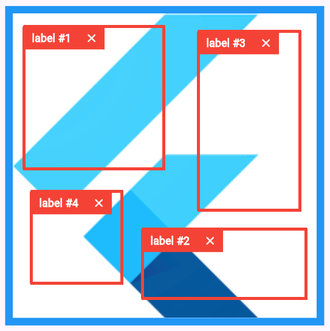

A widget to create bounding box annotation on an image.

## Preview
[](https://github.com/Accel03/bounding_box_annotation/blob/main/assets/preview.png)


## Features
- Draw rectangles (bounding boxes) on an image.
- Add custom text to label the annotation.
- Get annotation details (e.g. Offset).
- Crop image into multiple parts based on bounding boxes.


## Installation
Add the package to the `pubspec.yaml`:
```dart
dependencies:
  bounding_box_annotation: ^0.0.1
```

Import the package to your Dart code: 
``` dart
import 'package:bounding_box_annotation/bounding_box_annotation.dart'
```


## Usage
Create a `BoundingBoxAnnotation` widget, and pass the required parameters.
``` dart
final AnnotationController annotationController = AnnotationController();

BoundingBoxAnnotation(
    controller: annotationController,
    imageFile: imageFile
)
```


Create a `List` variable to store the annotation(s).
``` dart
List<AnnottaionDetails>> annotationList = [];
```


Get annotation details:
``` dart
final AnnotationController annotationController = AnnotationController();

List<AnnottaionDetails>> annotationList = await annotationController.getData();
```


Clear all annotation(s):
``` dart
final AnnotationController annotationController = AnnotationController();

annotationController.clear();
```


